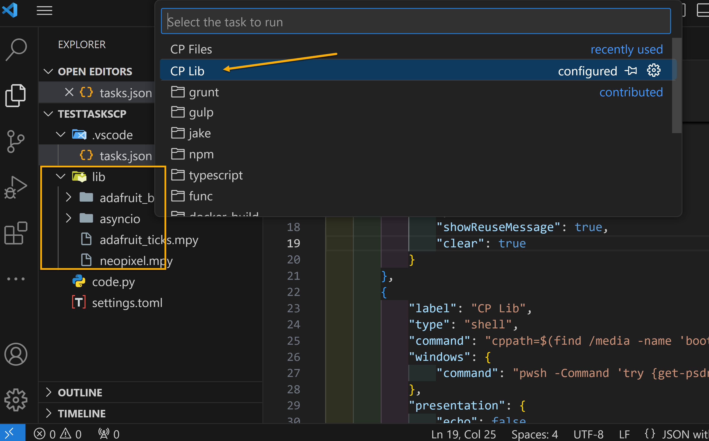

## Using Tasks in Visual Studio Code with CircuitPython


### VS Code has first class support for Python


### There is a full extension for CircuitPython support

[](https://marketplace.visualstudio.com/items?itemName=joedevivo.vscode-circuitpython){:target="_blank"} 

### Creating tasks in VS Code

Full documentaion for creating custom tasks is [here](https://code.visualstudio.com/Docs/editor/tasks#_custom-tasks){:target="_blank"}


### Tasks built to help maintain CircuitPython files

```json
{
    "version": "2.0.0",
    "tasks": [
        {
            "label": "CP Files",
            "options": {
                "statusbar": {
                    "label" : "$(sync) CPFiles"
                }
            }, 
            "type": "shell",
            "command": "cppath=$(find /media -name 'boot_out.txt' | sed 's/boot_out\\.txt$//' | head -n 1); if [ -z $cppath ]; then echo '** Could not find circuitpy drive**'; else if [ -f '${workspaceFolder}/.vscode/cpfiles.txt' ]; then mapfile -t fary < '${workspaceFolder}/.vscode/cpfiles.txt';  else fary=(\"code.py\"); fi ; for el in \"${fary[@]}\"; do { cp -f \"${workspaceFolder}/$(cut -d'>' -f1 <<< $el)\"  \"$cppath/$(cut -d'>' -f2 <<< $el)\"; echo \"copy of $el done\";  }; done; fi",
            "windows": {
                "command": "pwsh -Command 'try {get-psdrive -PSProvider FileSystem | Where-Object { $_.Name -ne ''temp'' } | foreach ($_.Name){get-volume $_.Name | Where-Object {$_.FileSystemLabel -eq ''CIRCUITPY''} } | select-object -Property DriveLetter -PipelineVariable fc | &{if (-not $fc) {throw ''*** CircuitPy drive not found ***''} ;$fary=@(''code.py''); if (Test-Path -Path ''${workspaceFolder}/.vscode/cpfiles.txt'') {$fary=Get-Content -Path ''${workspaceFolder}/.vscode/cpfiles.txt''}; $fary | foreach ($_) {copy -Force -ErrorAction SilentlyContinue -Path (''${workspaceFolder}/''+$_.split(''>'')[0]) -Destination ($fc.DriveLetter+'':/''+$_.split(''>'')[1]) && write-output (''copy done for file(s): ''+$_) || write-output (''*** error copying file: '' + $_)} } } catch {write-output $error} '"
                },
            "presentation": {
                "echo": false,
                "reveal": "always",
                "focus": false,
                "panel": "shared",
                "showReuseMessage": true,
                "clear": true
            }
        },
        {
            "label": "CP Lib",
            "options": {
                "statusbar": {
                    "label" : "$(sync) CPLib"
                }
            }, 
            "type": "shell",
            "command": "cppath=$(find /media -name 'boot_out.txt' | sed 's/boot_out\\.txt$//' | head -n 1); if [ -z $cppath ]; then echo '** Could not find circuitpy drive**'; else cp -a -f \"${workspaceFolder}/lib/.\"  \"$cppath/lib\"; echo \"copy of lib/* done\"; fi",
            "windows": {
                "command": "pwsh -Command 'try {get-psdrive -PSProvider FileSystem | Where-Object { $_.Name -ne ''temp'' } | foreach ($_.Name){get-volume $_.Name | Where-Object {$_.FileSystemLabel -eq ''CIRCUITPY''} } | select-object -Property DriveLetter -PipelineVariable fc | &{if (-not $fc) {throw ''*** CircuitPy drive not found ***''} ;if (-not (Test-Path -Path ''${workspaceFolder}/lib'')) {throw ''*** lib source folder does not exist ***''}; Copy-Item -Force -ErrorAction SilentlyContinue -Path (''${workspaceFolder}/lib'') -Recurse -Destination ($fc.DriveLetter+'':/'') && write-output (''copy done for lib/*'') || write-output (''*** error copying lib files'') } } catch {write-output $error} '"
                },
            "presentation": {
                "echo": false,
                "reveal": "always",
                "focus": false,
                "panel": "shared",
                "showReuseMessage": true,
                "clear": true
            }
        }
    ]
}
```





### Configure multiple file copies


### Extension to provide statusbar "buttons"


### Running on Linux including remote development


